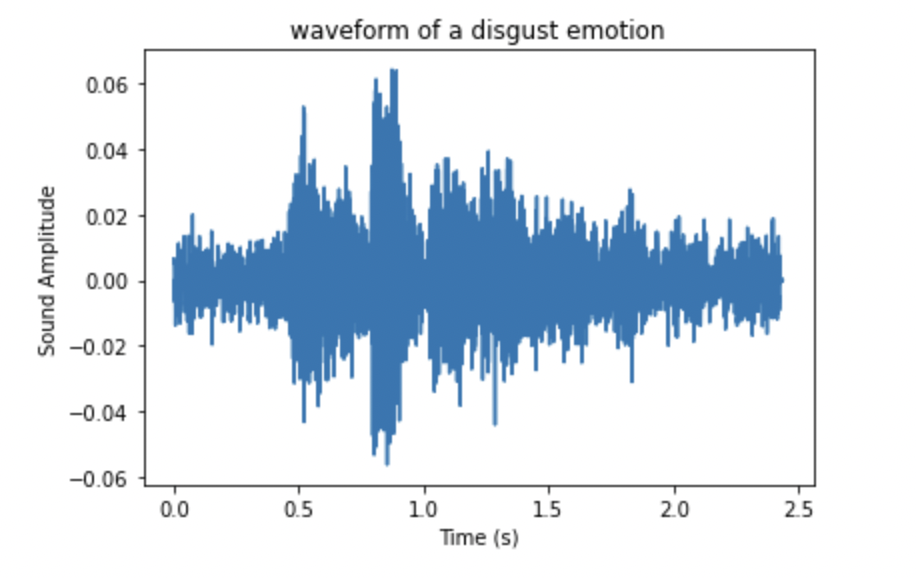

# Speech-Emotion-Recognition
Speech is the most natural way of expressing ourselves as humans. It is only natural then to extend this communication medium to computer applications. We define speech emotion recognition (SER) systems as a collection of methodologies that process and classify speech signals to detect the embedded emotions. SER is not a new field, it has been around for over two decades, and has regained attention thanks to the recent advancements. These novel studies make use of the advances in all fields of computing and technology, making it necessary to have an update on the current methodologies and techniques that make SER possible. We have identified and discussed distinct areas of SER, provided a detailed survey of current literature of each, and also listed the current challenges.
# Dataset
Our [dataset](https://www.kaggle.com/datasets/dmitrybabko/speech-emotion-recognition-en?select=Ravdess) is more than 10K audio files and each of them is 2-4 seconds. The whole dataset is more than 3GB.  
There are 6 different categroy: 
- SAD - Sadness
- ANG - Angry
- DIS - Disgust
- FEA - Fear
- HAP - Happy
- NEU - Neutral

# Data Cleaning
Since each file have different length, we need to adjust their length, we also need to chech the null value


```python
# check the length of audio and chop them into same length
def adjust_length(time_series_list, length):
    n = len(time_series_list)
    for i in range(n):
        audio_length = len(time_series_list[i])
        if audio_length < length:
            time_series_list[i] = np.append(time_series_list[i], [0 for i in range(length-audio_length)])
        else:
            time_series_list[i] = np.array(time_series_list[i][:length])
```
# Model and Result
We used Pytorch to build our model. We follow the structure of the ResNet but instead of using `nn.Conv2D` we change to `nn.Conv1D`  
| Model | Accuracy |
|--------|--------|
| CNN(ResNet) | 0.9 |
| CNN(AlexNet) | 0.8 |
| GRU|...|
|RNN|...|

